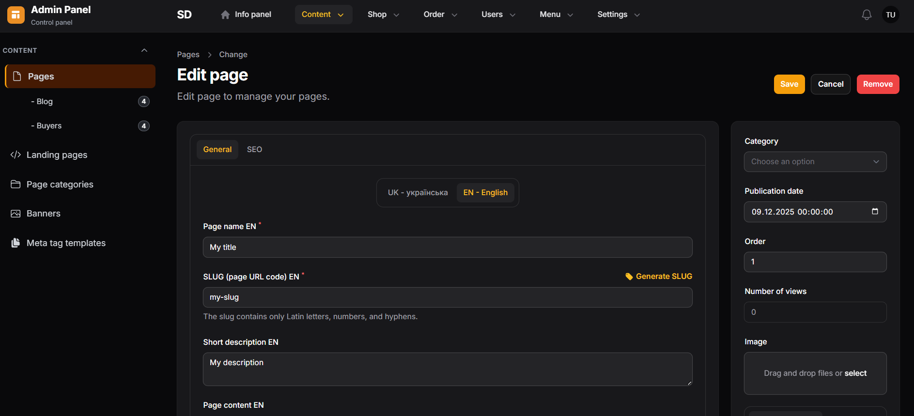

# Filament Translatable

[](https://packagist.org/packages/levgenij/filament-translatable)
[](https://packagist.org/packages/levgenij/filament-translatable)
[](https://packagist.org/packages/levgenij/filament-translatable)

Seamless multilingual support for Filament Resources with automatic translatable field generation based on [levgenij/laravel-translatable](https://github.com/levgenij/laravel-translatable).



## Features

- **Zero Configuration** - Translatable fields are detected automatically from the model
- **Language Tabs** - Fields are grouped into tabs for each locale
- **Locale Badges** - Visual indicators next to field labels: `Title [EN]`
- **Clean Form Schema** - No wrappers or special syntax needed
- **Single Locale Mode** - No tabs or badges when only one locale is configured
- **Filament v3 & v4** - Compatible with both major versions

## Requirements

- PHP 8.1+
- Laravel 10+
- Filament 3.0+ or 4.0+
- levgenij/laravel-translatable 3.0+

## Installation

Install the package via Composer:

```bash
composer require levgenij/filament-translatable
```

The package will auto-register its service provider.

### Publish Configuration (Optional)

```bash
php artisan vendor:publish --tag=filament-translatable-config
```

## Quick Start

### 1. Configure Your Model

Your model must use the `Translatable` trait from `levgenij/laravel-translatable`:

```php
<?php

namespace App\Models;

use Illuminate\Database\Eloquent\Model;
use Levgenij\LaravelTranslatable\Translatable;

class Category extends Model
{
    use Translatable;

    protected $fillable = [
        'parent_id',
        'is_active',
        'sort',
        // Translatable fields must also be in fillable
        'title',
        'slug',
        'description',
    ];

    /**
     * Translatable attributes.
     */
    public array $translatable = [
        'title',
        'slug',
        'description',
        'meta_title',
        'meta_description',
    ];
}
```

### 2. Add Trait to Resource

```php
<?php

namespace App\Filament\Resources;

use Filament\Forms;
use Filament\Forms\Form;
use Filament\Resources\Resource;
use Levgenij\FilamentTranslatable\Concerns\TranslatableResource;

class CategoryResource extends Resource
{
    use TranslatableResource;

    protected static ?string $model = Category::class;

    public static function form(Form $form): Form
    {
        return $form->schema([
            Forms\Components\Section::make([
                // Translatable fields (detected from $model->translatable)
                Forms\Components\TextInput::make('title')
                    ->label('Title')
                    ->required(),

                Forms\Components\TextInput::make('slug')
                    ->label('Slug'),

                Forms\Components\Textarea::make('description')
                    ->label('Description'),

                // Non-translatable fields (remain unchanged)
                Forms\Components\Toggle::make('is_active')
                    ->label('Active'),

                Forms\Components\Select::make('parent_id')
                    ->label('Parent Category')
                    ->options(fn () => Category::pluck('title', 'id')),
            ]),
        ]);
    }
}
```

### 3. Add Trait to Create/Edit Pages

**CreateRecord:**

```php
<?php

namespace App\Filament\Resources\CategoryResource\Pages;

use App\Filament\Resources\CategoryResource;
use Filament\Resources\Pages\CreateRecord;
use Levgenij\FilamentTranslatable\Concerns\HasTranslatableFields;

class CreateCategory extends CreateRecord
{
    use HasTranslatableFields;

    protected static string $resource = CategoryResource::class;
}
```

**EditRecord:**

```php
<?php

namespace App\Filament\Resources\CategoryResource\Pages;

use App\Filament\Resources\CategoryResource;
use Filament\Resources\Pages\EditRecord;
use Levgenij\FilamentTranslatable\Concerns\HasTranslatableFields;

class EditCategory extends EditRecord
{
    use HasTranslatableFields;

    protected static string $resource = CategoryResource::class;
}
```

That's it! Your form will now automatically display translatable fields in language tabs.

## Configuration

### Locales

By default, the package reads locales from `config/translatable.php` (the parent package). You can override this in `config/filament-translatable.php`:

```php
<?php

return [
    // Detailed format
    'locales' => [
        'en' => ['name' => 'En', 'native' => 'English'],
        'uk' => ['name' => 'Uk', 'native' => 'українська'],
        'de' => ['name' => 'De', 'native' => 'Deutsch'],
    ],

    // Or simple array format
    'locales' => ['en', 'uk', 'de'],
];
```

### Badge Style

Customize the locale badge appearance:

```php
'badge_style' => 'display: inline-flex; padding: 2px 6px; font-size: 10px; background-color: #3b82f6; color: white; border-radius: 4px;',
```

## How It Works

### Architecture

```
src/
├── Concerns/
│   ├── TranslatableResource.php      # Trait for Resource class
│   └── HasTranslatableFields.php     # Trait for Create/Edit pages
├── Support/
│   └── TranslatableSchemaTransformer.php  # Form schema transformation
└── FilamentTranslatableServiceProvider.php
```

### Data Flow

1. **Resource** - The `TranslatableResource` trait provides the `getTranslatableAttributes()` method that reads the model's `$translatable` property.

2. **Page** - The `HasTranslatableFields` trait intercepts the `form()` method and transforms the schema:
   - Finds fields that exist in `$model->translatable`
   - Groups them into language tabs (when multiple locales)
   - Adds locale badges to labels
   - Non-translatable fields remain unchanged

3. **Saving** - The trait automatically:
   - Extracts translation data from the form
   - Saves them via `$model->saveTranslation($locale, $data)`

### Form Data Structure

Data in the form is stored in this structure:

```php
[
    // Non-translatable
    'is_active' => true,
    'parent_id' => 1,

    // Translatable
    'translations' => [
        'en' => [
            'title' => 'English Title',
            'slug' => 'english-title',
            'description' => 'English description',
        ],
        'uk' => [
            'title' => 'Ukrainian Title',
            'slug' => 'ukrainian-title',
            'description' => 'Ukrainian description',
        ],
    ],
]
```

## UI Behavior

### Multiple Languages

When multiple languages are configured, translatable fields are grouped into tabs:

```
┌─────────────────────────────────────────────────┐
│  [EN - English]  [UK - українська]              │
├─────────────────────────────────────────────────┤
│  Title [EN]                                     │
│  ┌─────────────────────────────────────────┐   │
│  │ Product Name                             │   │
│  └─────────────────────────────────────────┘   │
│                                                 │
│  Description [EN]                               │
│  ┌─────────────────────────────────────────┐   │
│  │ Product description text...              │   │
│  └─────────────────────────────────────────┘   │
└─────────────────────────────────────────────────┘

│  Is Active                                      │
│  [✓]                                            │
```

### Single Language

When only one language is configured:
- Tabs are not shown
- Badges are not shown
- Fields are displayed normally

## Advanced Usage

### Overriding mutateFormDataBeforeFill

If you need additional logic when filling the form:

```php
class EditCategory extends EditRecord
{
    use HasTranslatableFields;

    protected function mutateFormDataBeforeFill(array $data): array
    {
        // First call parent method to load translations
        $data = parent::mutateFormDataBeforeFill($data);

        // Your additional logic
        $data['custom_field'] = $this->record->computeSomething();

        return $data;
    }
}
```

### Overriding mutateFormDataBeforeCreate/Save

```php
class CreateCategory extends CreateRecord
{
    use HasTranslatableFields;

    protected function mutateFormDataBeforeCreate(array $data): array
    {
        // Your logic before creation
        if (! empty($data['image'])) {
            $data['image'] = $this->processImage($data['image']);
        }

        return $data;
    }
}
```

### Custom Validation

Validation works as expected. Use the `translations.{locale}.{field}` path for custom rules:

```php
public static function form(Form $form): Form
{
    return $form->schema([
        Forms\Components\TextInput::make('title')
            ->required()
            ->maxLength(255)
            ->rules(['unique:categories_translations,title']),
    ]);
}
```

## Database Structure

The package works with `levgenij/laravel-translatable` which uses separate translation tables:

```
categories                    categories_translations
┌────┬───────────┬────────┐   ┌─────────────┬────────┬────────────────┬───────┐
│ id │ is_active │ parent │   │ category_id │ locale │ title          │ slug  │
├────┼───────────┼────────┤   ├─────────────┼────────┼────────────────┼───────┤
│ 1  │ true      │ null   │   │ 1           │ en     │ Electronics    │ elec  │
│ 2  │ true      │ 1      │   │ 1           │ uk     │ Електроніка    │ elek  │
└────┴───────────┴────────┘   │ 2           │ en     │ Phones         │ phone │
                              │ 2           │ uk     │ Телефони       │ tel   │
                              └─────────────┴────────┴────────────────┴───────┘
```

## Troubleshooting

### Fields are not transformed

Make sure that:
1. Resource has `use TranslatableResource;`
2. Page has `use HasTranslatableFields;`
3. Model has `$translatable` property with correct fields
4. Model uses `use Levgenij\LaravelTranslatable\Translatable`

### Translations are not saved

Make sure that:
1. Table `{table}_translations` exists
2. Fields are in model's `$fillable`
3. Fields are in model's `$translatable`

### Error "Call to undefined method saveTranslation"

Model does not use the `Levgenij\LaravelTranslatable\Translatable` trait.

## Changelog

Please see [CHANGELOG](CHANGELOG.md) for more information on what has changed recently.

## Contributing

Please see [CONTRIBUTING](CONTRIBUTING.md) for details.

## Security

If you discover any security-related issues, please email levgenij@example.com instead of using the issue tracker.

## Credits

- [Levgenij](https://github.com/levgenij)
- [All Contributors](../../contributors)

## License

The MIT License (MIT). Please see [License File](LICENSE) for more information.

